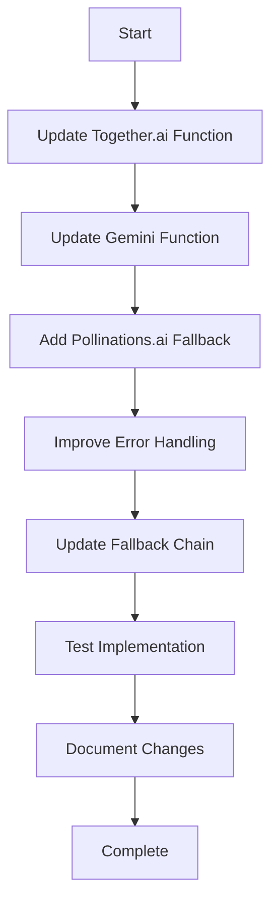
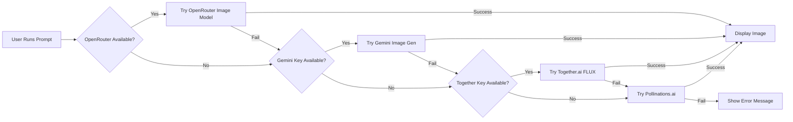

# Image Generation Fix Plan

## Current Issues Identified

### 1. Together.ai Image Generation
**Location:** `netlify/functions/execute.ts` - `generateImageWithTogether()` function

**Problems:**
- Model name `black-forest-labs/FLUX.1-schnell-Free` may be deprecated or changed
- API response format may have changed
- Limited error logging makes debugging difficult

**Current Implementation:**
```typescript
const response = await fetch('https://api.together.xyz/v1/images/generations', {
    method: 'POST',
    headers: {
        'Authorization': `Bearer ${togetherKey}`,
        'Content-Type': 'application/json'
    },
    body: JSON.stringify({
        model: 'black-forest-labs/FLUX.1-schnell-Free',
        prompt: prompt,
        width: 1024,
        height: 1024,
        n: 1,
        response_format: 'b64_json'
    })
});
```

### 2. Gemini Image Generation
**Location:** `netlify/functions/execute.ts` - `generateImageWithGemini()` function

**Problems:**
- Model name `gemini-2.0-flash-exp-image-generation` may be deprecated or changed
- Response structure for image generation may have changed
- The model may not support direct image generation anymore

**Current Implementation:**
```typescript
const model = genAI.getGenerativeModel({
    model: "gemini-2.0-flash-exp-image-generation",
    generationConfig: {
        responseModalities: ["image", "text"],
    }
});
const result = await model.generateContent(`Generate an image: ${prompt}`);
```

### 3. Missing Free Fallback
- No Pollinations.ai integration (free, no API key required)
- Users without API keys have no working image generation option

## Proposed Solution

### Phase 1: Update Together.ai Function
1. Update model name to current Together.ai FLUX model
2. Add comprehensive error logging
3. Handle different response formats
4. Add retry logic for transient errors

### Phase 2: Update Gemini Function
1. Update to current Gemini image generation model
2. Verify response structure handling
3. Add better error messages
4. Consider using Imagen 3 API if available

### Phase 3: Add Pollinations.ai Fallback
1. Create new `generateImageWithPollinations()` function
2. Use URL-based API (no API key required)
3. Format: `https://image.pollinations.ai/prompt/{encoded_prompt}`
4. Add as final fallback in the chain

### Phase 4: Improve Error Handling
1. Add detailed logging for each service
2. Return specific error messages to user
3. Track which service succeeded
4. Add timeout handling

## Implementation Order



## Updated Fallback Chain



## Files to Modify

1. `netlify/functions/execute.ts` - Main implementation file
2. `.env.example` - Add Pollinations.ai documentation (no key needed)

## Testing Checklist

- [ ] Test with valid Together.ai API key
- [ ] Test with valid Gemini API key
- [ ] Test without any API keys (Pollinations.ai only)
- [ ] Test with invalid API keys
- [ ] Test image display in chat
- [ ] Test error messages
- [ ] Test timeout handling
- [ ] Test large prompts
- [ ] Test special characters in prompts

## Success Criteria

1. Image generation works with at least one service
2. Clear error messages when all services fail
3. Images display correctly in the chat
4. No console errors in production
5. Fallback chain works as expected
